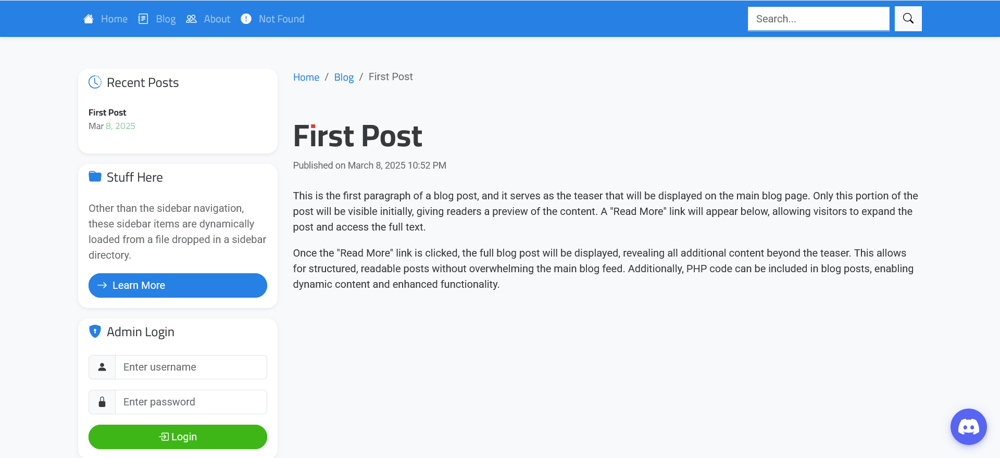

# 🚀 TemplateForge

**TemplateForge** is a modular, flat-file-based PHP website framework, designed to deliver dynamic content, a blog system, analytics, and search—without relying on a database.

---

## 📸 Screenshots

### 🏠 Homepage


### 📝 Blog System



### 🔑 Admin Dashboard


### 📊 Analytics Page


---

## 📌 Key Features

### 🗂 Flat-File Content Management

* **Modular Content:** Pages live in `/pages/` as individual PHP files.
* **Blog System:** Posts are stored in `/blog_posts/`.
* **SEO-Ready Pages:** Includes sitemap, privacy policy, and 404 support.

### 🎨 Centralized Template System

* **Unified Layout:** `main_template.php` governs the full site design.
* **Dynamic Content Injection:** Pages, blog posts, and sidebars are seamlessly rendered.
* **Template Variants:** Dedicated templates for blog listings, blog posts, and search.

### 🧩 Modular Add-On & Widget Support

* **Auto-Loaded Addons:** `/config/addons/` supports plug-and-play PHP modules.
* **Built-In Addons:** Bootstrap nav, cookie consent modal, AdSense, metadata injector, and more.
* **Sidebar & Widgets:** Prebuilt components like login, recent posts, random content, adsense, and comments.

### 🔑 Admin Area

* **User Authentication:** Login/logout with `.htpasswd` support.
* **Content Management:** Create, edit, and delete pages/posts.
* **Site Settings:** Update configuration, navigation, and widgets.
* **Analytics Dashboard:** Tracks page/blog views (JSON-driven).
* **Advanced Tools:** Upload manager, logs, system info, activity tracking.
* **Template-Based UI:** Admin layout centralized in `/admin/templates/admin_template.php`.

### 🔍 Search & SEO

* **Built-In Search:** Results rendered with `search_template.php`.
* **RSS Feed:** Auto-generated feed via `rss.php`.
* **Sitemap & Robots:** Ready-to-use `/pages/sitemap.php` and `robots.txt`.
* **Favicon Support:** `favicon.ico` included.

### 📊 Analytics & Tracking

* **Page Views Tracking:** Stored in `/config/data/analytics.json`.
* **Admin Analytics:** Dedicated `/admin/pages/analytics.php`.
* **Custom Tracker:** `track.php` for lightweight analytics logging.

### 🛠 Developer-Friendly

* **Simple Config:** `config.php`, plus navigation via `navbar.txt` and `navigation.txt`.
* **Test Utilities:** `test.php` for dev/testing.
* **Flat-File Storage:** Easy migration, backup, and version control.

---

## 📂 Directory Structure

```plaintext
/index.php                # Main entry point
/.htaccess                # URL rewriting rules
/favicon.ico              # Site icon
/robots.txt               # SEO crawler rules
/rss.php                  # Blog RSS feed
/track.php                # Tracking script
/admin/                   # Admin area
  ├── index.php           # Admin dashboard
  ├── login_module.php    # Login handling
  ├── logout.php          # Logout
  ├── logger.php          # Activity logging
  ├── pages/              # Admin modules (create/edit content, analytics, logs, settings)
  ├── widgets/            # Admin widgets (adsense, comments, etc.)
  └── templates/          # Admin template
/blog_posts/              # Blog post files
/config/                  # Config files
  ├── config.php          # Main settings
  ├── addons/             # Add-ons (nav, adsense, cookie modal, etc.)
  ├── data/               # Analytics JSON data
/css/style.css            # Stylesheet
/pages/                   # Static pages
/sidebars/                # Sidebar modules
/templates/               # Templates (main, blog, search)
```

---

## ⚙️ Installation & Setup

1. **PHP 7+ Required** on your server.
2. **Upload Files** to your hosting environment.
3. **Configure Site** via `config/config.php`, `navbar.txt`, and `navigation.txt`.
4. **Login to Admin Area** (`/admin/`) to manage content, users, and settings.

---

## 🔄 URL Rewriting & .htaccess

TemplateForge uses `.htaccess` for clean URLs:

```apache
RewriteEngine On
RewriteCond %{REQUEST_FILENAME} !-f
RewriteCond %{REQUEST_FILENAME} !-d
RewriteRule ^(.*)$ index.php?url=$1 [QSA,L]
```

---

## 🚨 404 Handling

Missing pages automatically load `/pages/404.php` with an HTTP 404 response.

---

## 🚀 Future Enhancements

* ⚡ **Performance Optimization:** Optional caching layer.
* 🔗 **Plugin Marketplace:** Expand add-on ecosystem.
* 📈 **Advanced Analytics:** Charts and reporting.

---

## 🏁 Conclusion

TemplateForge is a **database-free CMS-style framework**—modular, extensible, and easy to deploy. From blogs to full websites, it’s designed to scale without complexity. 🚀

> 💡 **Contributions Welcome** — Open issues and PRs are encouraged! 🎉
